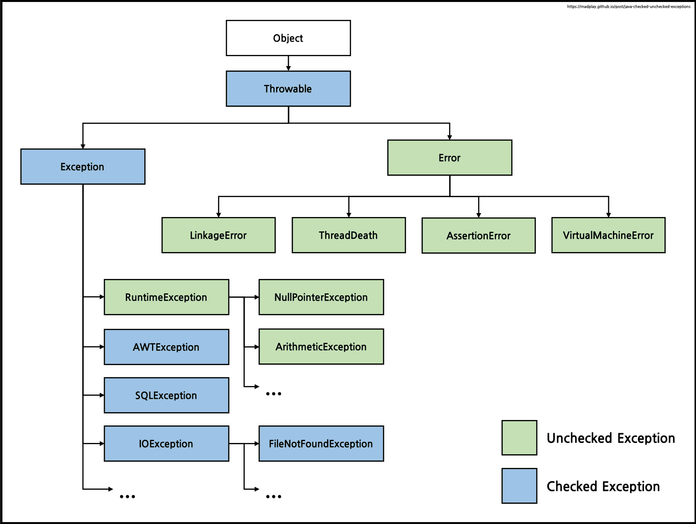

# 자바 예외의 종류

## 부적절한 예외처리

### 예외 블랙홀

```java
				try {
            // ...
        } catch (SQLException e) {
            // 예외를 잡고는 아무것도 하지 않는다.
        }

        // 예외발생 시 콘솔에 출력
        } catch (SQLException e) {
            System.out.println(e);
        }
```

- 다음과 같이 예외를 잡고 아무것도 하지 않고 넘어가는 건 예상치 못한 문제를 발생시킬 수 있다
- 콘솔에 출력하는건 개발 환경에서는 확인이 가능하지만 운영 서버에 올라가면 발견하기 힘들다

  <br>

### 무의미하고 무책임한 throws

```java
public void method1() throws Exception { // 예외 전달
		method2();
    // ...
}

public void method2() throws Exception { // method1()로 예외 전달
		method3();
}

public void method3() throws Exception { // method2()로 예외 전달
		// ...
}
```

- 메소드 선언에서 의미있는 정보를 알기 힘들다.
- 또한 이런 메소드를 사용하는 메소드에서도 throws Exception을 붙여야한다.

## 예외의 종류

### Error

- java.lang.Error 클래스의 서브 클래스
- 시스템에 비정상적인 상황이 발생했을 경우 사용한다.
- 주로 자바 VM에서 발생시키며 OutOfMemoryError, ThreadDeath 같은 에러로 애플리케이션 코드로 잡을 수 없다

### Exception

- Error와 달리 애플리케이션 코드에서 예외가 발생했을 경우에 사용된다.

<p align="center">
  
</p>

**Checked Exception**

- java.lang.Exception 클래스의 서브 클래스
- `예외처리가 필수`로 처리코드가 없다면 컴파일 에러가 발생한다

**Unchecked Exception**

- 반드시 예외를 처리하지 않아도 괜찮다.
- 명시적인 예외처리를 강제하지 않는다.
