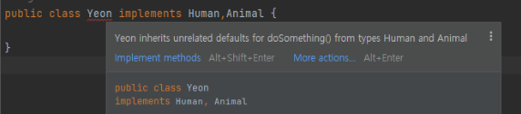

# 추상 클래스/ 인터페이스

### 다중 상속

1. **자바에서 클래스의 다중 상속은 불가능**
    
    → 두 개의 클래스에서 같은 메소드를 상속 받으면 둘 중 어느 것을 상속 받을지 판단할 수 없다. 
    
2. **But, 인터페이스의 다중 상속은 가능**
    
    → 두 개의 인터페이스에서 같은 메소드를 상속 받을 때는 아직 구현되지 않은 추상 메소드이기 때문에 가능하다.
    

## 추상 클래스

- 추상 메소드를 선언하여 상속을 통해 자식 클래스에서 완성하도록 유도하는 클래스

### **특징**

1. 최소 하나 이상의 추상 메소드를 포함 
    - 추상 메소드가 아닌, 미리 구현 된 메소드를 가질 수도 있다
2. 상속을 위한 클래스이기 때문에 객체 생성이 불가능
3. 다중 상속 불가능

## 인터페이스

- 구현을 위한 설계도

### **특징**

1. 모든 메소드 가 추상 메소드 
    - 인터페이스 내의 모든 메소드 는 **추상 메소드** 이기 때문에 abstract을 (굳이) 붙이지 않는다
2. 다중 상속이 가능

## JAVA8 **default 인터페이스**

- 인터페이스에서 구현이 가능해짐
- default method와 static method 사용

### default method

- 메소드 이름 앞에 default 키워드를 붙여 사용 가능

```java
public interface Human{
    public default void doSomething(int n) {
        System.out.println("Human doSomething!!!!");
    }
}
```

- 인터페이스를 implements해 사용 가능

```java
public interface Human{
    public default void doSomething() {
        System.out.println("Human doSomething!!!!");
    }
}

public static class Yeon implements Human{
}

public static void main(String args[]) {
    Yeon yeonjin = new Yeon();
    yeonjin.doSomething();
}
// 실행 결과
// Human doSomething!!!!
```

### 다중 상속 문제

- 클래스에서 다중 상속이 금지되었던 이유가 같은 이름으로 구현된 여러 메소드들 중 어떤 메소드를 상속 받을지 모르기 때문
- default 인터페이스 사용 시 같은 문제 발생

```java
public interface Human{
    public default void doSomething() {
        System.out.println("Human doSomething!!!!");
    }
}

public interface Animal{
    public default void doSomething() {
        System.out.println("Aniaml doSomething!!!!");
    }
}

public class Yeon implements Human, Animal{
}
```

위의 코드를 실행시키면 다음과 같은 에러가 발생

<p align="center">
  
</p>

**방법 1) 어떤 메소드를 상속 받을지 몰라서 생기는 문제로 아래와 같이 상속 받을 메소드를 정해주기**

```java
public class Yeon implements Human,Animal {
    @Override
    public void doSomething() {
        Human.super.doSomething();
    }
}

public static void main(String args[]) {
    Yeon yeon = new Yeon();
    yeon.doSomething(); // Human doSomething!!!!
}
```

방법 2) ****extends와 implements 동시에 사용****

extends의 우선순위가 높아 부모 클래스의 메소드를 사용

```java
public interface Vehicle {
    public default void doSomething(int n) {
        System.out.println("doSomething(Vehicle)");
    }
}

public interface Movable {
    public default void doSomething(int n) {
        System.out.println("doSomething(Movable)");
    }
}

public static class Car implements Vehicle {
    @Override
    public void doSomething(int n) {
        System.out.println("doSomething(Car)");
    }
}

public static class MovableCar extends Car implements Movable {
}

public static void main(String args[]) {
    MovableCar car = new MovableCar();
    car.doSomething(10); //doSomething(Car)
}
```

## 추상 클래스 vs 인터페이스

디폴트 메소드로 둘의 차이가 없어 보이지만 아래와 같은 차이가 있음

### 공통점

- 추상 클래스와 인터페이스 둘 다 객체로 만들 수 없다

### 차이점

- 추상 클래스에는 public, protected, private 메소드를 가질 수 있지만 인터페이스는 public만 허용
- 추상 클래스에는 멤버 변수 선언이 가능하지만 인터페이스는 public static 변수만 선언이 가능
- 인터페이스는 implements 키워드로 여러 인터페이스 구현 가능,  추상클래스는 extends 키워드로 1개의 클래스만 상속받을 수 있음